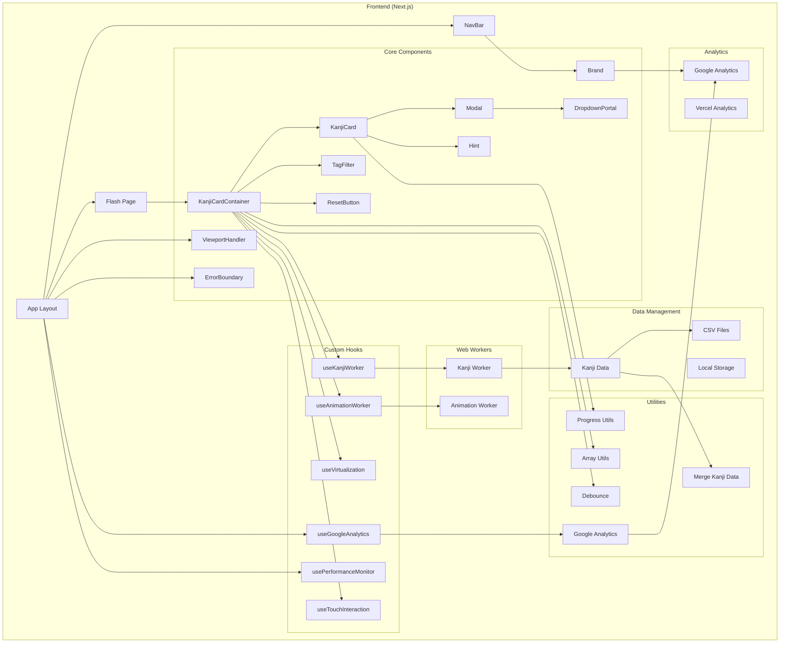

# Kantoku Kanji TikTokku - Technical Documentation

## Architecture Diagram

## Overview
Kantoku Kanji TikTokku is a Next.js-based web application designed for learning Japanese Kanji through an interactive, TikTok-style card interface. The application emphasizes user experience, performance optimization, and accessibility.

## Tech Stack
- **Framework**: Next.js 14
- **Language**: TypeScript
- **UI Libraries**: 
  - Framer Motion (animations)
  - Tailwind CSS (styling)
- **Analytics**: 
  - Google Analytics
  - Vercel Analytics
- **Performance**: 
  - Web Workers
  - Virtualization
  - Touch Optimization

## Core Features

### 1. Kanji Card System
- TikTok-style vertical swipe interface
- Interactive card components with:
  - Kanji character display
  - Meaning translations
  - Reading validation
  - Progress tracking
- Multi-device interaction support (touch, mouse, keyboard)
- Tag-based filtering system

### 2. Data Management
- CSV-based Kanji data source
- Local storage for progress persistence
- Web Worker for data processing
- Tag-based organization

### 3. Performance Optimizations
- Dual Web Worker system:
  - Kanji Worker for data processing
  - Animation Worker for smooth transitions
- Virtualization for memory efficiency
- Touch interaction optimization
- Performance monitoring

## Core Components

### KanjiCardContainer
Central orchestrator managing:
- Card state and transitions
- Progress tracking
- Tag filtering
- Worker communication
- Virtualization

### KanjiCard
Individual card component handling:
- Character display
- Input validation
- Animation states
- Analytics events

### Supporting Components
- **ViewportHandler**: Mobile viewport management
- **TagFilter**: Tag-based filtering interface
- **Modal**: Information and settings display
- **ErrorBoundary**: Graceful error handling
- **Brand**: Navigation and attribution
- **Hint**: User assistance system

## Custom Hooks

### Data and Interaction
- **useKanjiWorker**: Kanji data processing
- **useAnimationWorker**: Animation coordination
- **useTouchInteraction**: Touch event handling
- **useVirtualization**: Memory optimization

### Monitoring
- **useGoogleAnalytics**: Analytics integration
- **usePerformanceMonitor**: Performance tracking

## Utilities

### Core Utils
- **arrayUtils**: Array manipulation
- **debounce**: Event optimization
- **mergeKanjiData**: Data processing
- **progressUtils**: Progress tracking
- **gtag**: Analytics helpers

### Web Workers
- **kanjiWorker**: Data processing
- **animationWorker**: Animation handling

## Data Flow
1. CSV data loaded through Kanji Worker
2. Data processed and cached locally
3. User interactions tracked and persisted
4. Progress synced with local storage
5. Analytics events dispatched

## Performance Considerations
- Web Worker offloading
- Virtualized rendering
- Touch event optimization
- Animation performance
- Resource loading strategies

## Analytics Implementation
- Interaction tracking
- Performance metrics
- Error monitoring
- User journey analysis

This documentation provides a technical overview of the current implementation. For specific implementation details, refer to the corresponding component files in the source code.